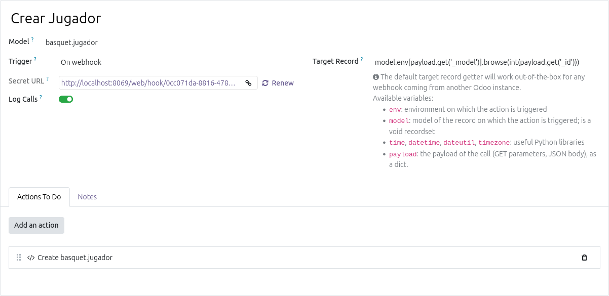
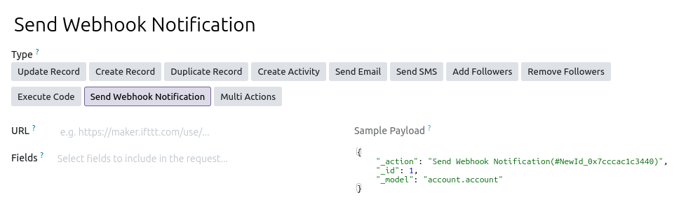

# Automatizacions amb Odoo

## Automated actions i Webhooks

Odoo té una funcionalitat integrada que permet crear accions automatitzades basades en esdeveniments. Aquestes accions es poden configurar per a executar-se quan es produeix un esdeveniment específic, com ara la creació d'un registre, la modificació d'un registre o la supressió d'un registre. Aquestes accions poden ser molt útils per a automatitzar processos interns dins d'Odoo. Per exemple, es pot configurar una acció automatitzada per a enviar un correu electrònic a un client quan es crea una nova ordre de venda.

Es necessita instal·lar el mòdul `Automated Actions` (base_automation). La versió de pagament d'Odoo té `Studio`, que permet crear accions automatitzades de manera visual, però la versió comunitària també permet crear-les, encara que de manera més tècnica. Per a crear una acció automatitzada, es pot anar a `Settings > Technical > Automated Actions` i crear una nova acció.

A més de les accions automatitzades, Odoo també permet configurar webhooks. Dins de l'arquitectura d'integració de sistemes orientada a esdeveniments, Odoo opera de manera completament bidireccional en actuar simultàniament com a receptor (*inbound*) i emissor (*outbound*) de *webhooks*. En la seua faceta receptora, la plataforma exposa punts d'accés (endpoints) URL per a capturar peticions HTTP de sistemes externs i desencadenar accions automàtiques immediates com la creació o modificació de registres; d'altra banda, en el seu rol com a emissor, aprofita el motor d'accions automatitzades intern per a monitoritzar mutacions en la base de dades —com la generació de factures o ruptures de stock— i notificar instantàniament a tercers mitjançant paquets de dades JSON.

### Casos d'ús del webhooks

Els *webhooks* en Odoo funcionen com a ponts d'automatització amb sistemes externs, i un dels seus usos principals és l'actualització automatitzada de registres existents, com ara modificar la divisa d'una comanda de venda. Este cas és especialment útil per a empreses amb filials internacionals que necessiten consolidar la seua informació financera en la moneda de la matriu (per exemple, USD) o durant processos de fusió empresarial; el sistema extern envia les dades de la comanda i Odoo localitza el registre instantàniament per a actualitzar el field de la moneda sense intervenció manual.

D'altra banda, estos mecanismes també són idonis per a la creació automàtica de nous registres en la base de dades, com ocorre amb l'alta de nous contactes, clients o proveïdors. Mitjançant la recepció d'informació bàsica (com el nom, el correu electrònic i el telèfon) des de formularis web o aplicacions de tercers, Odoo és capaç de processar estes dades en temps real, verificar els camps obligatoris i generar directament la fitxa de la persona en l'aplicació de **Contactes**, cosa que optimitza la sincronització i elimina les tasques administratives repetitives.

Els *webhooks* d'Odoo són preferibles als *web controllers* quan volem una integració "Low-Code" molt més ràpida i fàcil de configurar de forma gràfica, la qual cosa simplifica el manteniment i garanteix una millor compatibilitat i supervivència del sistema davant de futures actualitzacions de versió. Estan especialment dissenyats per a reaccionar de manera nativa a esdeveniments externs de tipus "disparar i oblidar" (com la recepció de dades d'un formulari), mentre que els *web controllers* requereixen programar mòduls a mida des de zero i només es recomanen quan es necessita dissenyar una API completament personalitzada o gestionar lògiques de negoci extremadament complexes.

> Les automatitzacions amb Odoo estan més pensades per a la versió professional que té `Studio`, ja que permet crear accions automatitzades de manera visual. Encara que es poden fer de forma més tècnica en la `community`. Més endavant veurem sistemes més potents com n8n. També es poden crear accions automatitzades amb `Python` i `XML` si volem instal·lar un mòdul a mida que les incorpore. Els usuaris pro d'Odoo no necessiten ser programadors i poden fer-ho tot de manera visual amb certs coneixements tècnics de l'aplicació. Les opcions i combinacions són molt diverses. amb experiència es pot decidir quina és la millor manera de fer cada cosa.

## Odoo i n8n

Per a automatitzar processos amb `Odoo` es pot incorporar una ferramenta de fluxos de treball que treballa amb un sistema low code. D'aquesta manera, inclús usuaris no tècnics poden crear automatitzacions i integracions entre Odoo i altres aplicacions.

N8n es pot instal·lar `on premise`, en el nuvol o en el seu servei en el nuvol. En el nostre cas anem a instal·lar-lo en un servidor on premise. Per a això, es pot utilitzar `Docker`, que facilita la instal·lació i gestió de l'aplicació.

### Instal·lació de n8n amb Docker

n8n utilitza `Nodejs`, per tant, sols amb `npm` es pot instal·lar. No obstant, la manera més senzilla d'instal·lar n8n és utilitzant Docker, ja que no cal preocupar-se per les dependències i la configuració del sistema. A més, Docker permet gestionar fàcilment les actualitzacions i les còpies de seguretat.

Es pot afegir al Docker compose d'Odoo un nou servei n8n.

> A aquestes altures del curs és possible que el Docker compose ja tinga Odoo, postgreSQL, nginx o inclús Ollama, Jupyter, entre altres. No hi ha cap problema en concentrar tots aquests serveis en un mateix Docker compose, sempre que es gestionen correctament els ports i les xarxes. No obstant, cal pensar en els recursos del servidor, ja que cada servei consumeix memòria i CPU. Si el servidor té recursos limitats, pot ser millor separa els serveis en diferents màquines. Si estem treballant en una IaaS també cal pensar en el preu de diversos servidors menuts especialitzats front a la reserva d'un servidor més potent.

El manual oficial (https://docs.n8n.io/hosting/installation/server-setups/docker-compose/#6-create-docker-compose-file ) dona un fitxer de composició molt complet i segur. Si el nostre n8n ha d'estar a internet cal seguir-lo, però per a fer proves és més sencill:

```yaml
services:
  n8n:
    image: docker.n8n.io/n8nio/n8n
    restart: always
    ports:
      - "5678:5678"
    environment:
      - N8N_HOST=localhost
      - N8N_PORT=5678
      - N8N_PROTOCOL=http
      - NODE_ENV=production
      - GENERIC_TIMEZONE=Europe/Madrid
      - TZ=Europe/Madrid
    volumes:
      - n8n_data:/home/node/.n8n
      - ./local-files:/files

volumes:
  n8n_data:
```

Al posar-lo en marxa, n8n estarà disponible a `http://<ip>:5678`. Ens demana registrar a l'administrador.

#### Solució de problemes

Si no recordem la contrasenya la podem restablir amb el següent comandament:

```bash
docker compose exec n8n n8n user-management:reset
```

> En general n8n dins del docker és un comandament del CLI que té moltes opcions. Al manual oficial estàn totes disponibles. 

## Integració d'Odoo amb n8n

> Abans de començar amb Odoo i n8n seria interessant fer algun `workflow` més senzill. A la web oficial hi ha molts templates per anar practicant.

Per a integrar Odoo amb n8n, es pot utilitzar el connector d'Odoo que n8n ofereix. Els oficials de n8n són connectors genèrics, per tant, no tenen totes les funcionalitats d'Odoo, però permeten fer moltes coses. Si necessitem alguna funcionalitat específica que no està disponible en el connector oficial, es pot crear un connector personalitzat utilitzant l'API d'Odoo i el connector HTTP Request de n8n.

### Connector personalitzat d'Odoo amb JSON-2

Com que el connector oficial d'Odoo no té totes les funcionalitats, es pot crear un connector personalitzat utilitzant l'API d'Odoo. Per a això, es pot utilitzar el node `HTTP Request` de n8n per a fer peticions a l'API d'Odoo.

JSON-2 utilitza peticions HTTP POST a endpoints generats per Odoo a cada model. En aquestes peticions s'especifica el métode a executar. Tots els models tenen uns endpoints base, però també es poden crear endpoints personalitzats per a funcionalitats específiques creant mètodes. D'aquesta manera es pot delegar part de l'automatització a Odoo, i n8n només s'encarrega de fer les peticions i gestionar els fluxos de treball.

> Per veure els endpoints disponibles a cada model i els payloads que accepten el millor és accedir a `/doc/` per a cada model. Per exemple: `http://localhost:8069/doc/res.partner#`

### Connectar amb Odoo amb un Webhook

Una autmatització en Odoo pot ser activada per un webhook. D'aquesta manera Odoo exposa un endpoint que executa aquesta acció. Si la tasca no és molt complexa i el payload tampoc aquesta és una opció válida que pot ser donada d'alta de manera visual o per codi. 

> Per a tasques realmente complexes, permanents i que necessiten molta lògica de negoci, pot ser millor crear un mòdul a mida que s'encarregue de tot amb Web Controllers.

Suposem que volem crear un webhook que rep dades d'un jugador de bàsquet i les guarda en un model a Odoo. Podem crear una acció automatitzada que s'executa quan es rep una petició HTTP POST a un endpoint específic. Aquesta acció pot processar les dades rebudes i crear un nou registre en el model de jugadors de bàsquet.



Després en actions seleccionem `Execute Python Code` i escrivim el codi que processa les dades rebudes i crea un nou registre en el model de jugadors de bàsquet. El codi pot ser similar al següent:

```python
player_name = payload.get('name')
if player_name:
    new_partner = env['basquet.jugador'].create({
        'name': player_name
        
    })
else:
    raise ValueError("Missing required fields: 'name'")
```

El codi té accés a la variable `payload`, que conté les dades rebudes en la petició HTTP POST.

Tot s'ha fet de forma gràfica, però no és complicat fer-ho amb `xml` de la mateixa manera que es fan les vistes o dades de demo. En aquest cas, el model és `base.automation`, que és el model de les accions automatitzades i `ir.actions.server` la acció on posarem el codi python.

La connexió amb n8n o Postman es fa enviant una petició HTTP POST a l'endpoint que Odoo ha generat per a aquesta acció automatitzada. El payload de la petició ha de ser un JSON amb les dades que volem processar. Per exemple:

```json
{
    "_model": "res.partner",
    "_id": 1,
    "name": "Kameron Taylor"
}
```

Sempre cal posar  el `_model` i `_id` del registre on es faria l'acció automatitzada, encara que no es facin servir en el codi. En aquest cas, com que no es fa servir cap registre específic, podem posar qualsevol model i id.

En cas de que es necessite el registre del payload es pot obtenir de `record`, `model` o `env` com en qualsevol acció automatitzada. 


### Crear un webhook en n8n per a rebre dades d'Odoo

L'altra opció és crear un webhook en n8n i que Odoo envie les dades a aquest webhook. Per a això, es pot crear un node `Webhook` en n8n i configurar-lo per a rebre peticions HTTP POST. Després, en Odoo, es pot crear una acció automatitzada que s'executa quan es produeix un esdeveniment específic (com la creació d'un nou registre) i que envia les dades a l'endpoint del webhook de n8n.



### Connectar amb Odoo amb un Web Controller

En aquest cas ja es té control absolut. Es crea un Web Controller a un mòdul que expose un endpoint. Cal gestionar correctament la seguretat i autenticació. El funcionament será com qualsevol servici HTTP. Si la tasca no ho necessita explícitament o no estem fent una API REST o similar, és millor optar per JSON-2, que ja està fet, amb funcions a mida.

### Connectar directament amb PostgreSQL

Com que n8n té un connector de PostgreSQL, també es pot connectar directament a la base de dades d'Odoo i fer les consultes SQL necessàries.

> És l'opció més perillosa i no es recomana. Amés, cal implementar mesures de seguretat a nivell de base de dades tant en usuaris com en la seua exposició a la xarxa.

Si s'està fent en `Docker` les dades de connexió estan al `docker compose`. Si n8n està al mateix compose la ruta pot ser `db`, per exemple, si no, cal exposar el port `5432` en el `Docker`.

## Misatges d'Odoo

Odoo té una funcionalitat integrada que permet enviar missatges a diferents destinataris, com ara usuaris, grups o canals de xat. Aquests missatges es poden utilitzar per a notificar als usuaris sobre esdeveniments importants Es comporta com moltes aplicacions de missatgeria integrada en Odoo i en alguns models, com ara el de les ordres de venda, que tenen com un xat associat. En realitat tots els xats d'Odoo, tant els generals com els dels models són canals associats a un model i registre.

> És adequat parlar de missatges d'Odoo en aquest apartat d'automatitzacions, ja que es poden utilitzar per a automatitzar notificacions i comunicacions dins de l'aplicació. Els usuaris han de saber que s'ha produït una acció automatitzada, un webhook o que n8n ha fet alguna cosa.

La manera més senzilla d'enviar un missatge és utilitzar el mètode `message_post` del model `mail.thread`:

https://www.odoo.com/documentation/master/developer/reference/backend/mixins.html#basic-messaging-system

``` python
record.message_post(body='This is a message')
```

Aquest mètode té molts paràmetres que permeten personalitzar el missatge, com ara el subjecte, els destinataris, els adjunts, etc. Per exemple, per a enviar un missatge a un grup d'usuaris:

``` python
record.message_post(body='This is a message', partner_ids=[(4, user.partner_id.id) for user in users])
``` 

També es poden enviar missatges a canals de xat:

``` python
record.message_post(body='This is a message', channel_ids=[(4, channel.id)])
``` 
A més, es poden utilitzar les funcions de mapeig i agrupació per a enviar missatges a grups d'usuaris o canals de xat de manera més eficient. Per exemple, per a enviar un missatge a tots els bancs associats als partners d'un registre:

``` python
for partner in record.partner_ids:
    partner.message_post(body='This is a message')  
```

En n8n es poden utilitzar els nodes de `HTTP Request` per a enviar peticions a l'API d'Odoo i utilitzar el mètode `message_post` per a enviar missatges des de n8n. També es poden utilitzar els nodes de `Function` per a processar les dades abans d'enviar els missatges.

Exemple de configuració d'un node `HTTP Request` en n8n per a enviar un missatge d'error a Odoo:

| Campo en n8n | Parámetro / Configuración | Valor / Expresión | Descripción |
| --- | --- | --- | --- |
| **Nombre del Nodo** | `name` | `Enviar mensaje error a Odoo` | Identificador del nodo en el flujo. |
| **Tipo de Nodo** | `type` | HTTP Request (v4.4) | Realiza una petición HTTP externa. |
| **Método HTTP** | `method` | **POST** | Envío de datos al servidor. |
| **URL del End-point** | `url` | `http://localhost:8069/json/2/discuss.channel/message_post` | Destino de la API de Odoo Chat/Discuss. |
| **Autenticación** | `authentication` | Predefined Credential (`httpBearerAuth`) | Autenticación mediante Token Bearer. |
| **Credencial Asociada** | `credentials` | *Bearer Auth account* (`id: vg9qrtrbzmATQP9a`) | Cuenta de credenciales guardada en n8n. |

*** Body Parameters***

| Parámetro (Name) | Tipo de Valor | Valor Configurado | Propósito |
| --- | --- | --- | --- |
| **`ids`** | Expresión | `{{ [1] }}` | Identificador del canal o hilo de Odoo destinatario. |
| **`body`** | Expresión | `Fallo al parsear {{ $('Limpieza').item.json.text }}` | Mensaje de error enviado, incluyendo el texto extraído del nodo 'Limpieza'. |
| **`message_type`** | String / Texto | `comment` | Tipo de mensaje dentro de Odoo. |
| **`subtype_id`** | String / Texto | `1` | Subtipo de registro o notificación. |

L'id 1 és el canal general. El message_type `comment` indica que és un comentari, juntament amb el `subtype_id` 1 implica una notificació normal i Odoo li aplica uns estils específics. Cal mirar en cada instància de Odoo quins són els valors adequats per a cada cas i si fa falta fer una petició prèvia per a obtenir-los.

