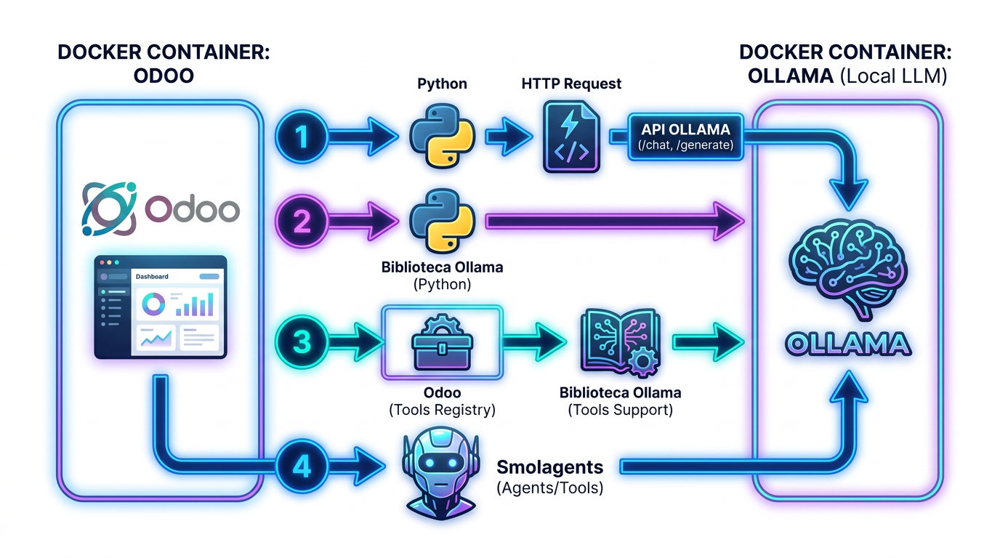
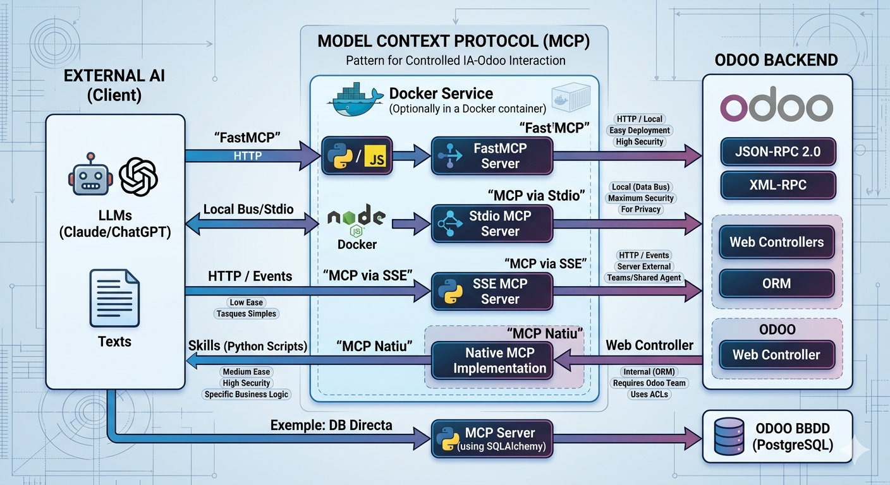

# Odoo i la intel·ligència artificial

## Introducció

La integració de la intel·ligència artificial (IA) en Odoo pot millorar l'eficiència i la presa de decisions en les empreses que utilitzen aquesta plataforma.

Odoo community no té els agents de IA que té la versió pro. Aquesta permet crear agents i consultes en llenguatge natural. Si volem utilitzar la IA en Odoo necessitem crear els nostres mòduls. 

Quan parlem de IA en Odoo podem parlar de qualsevol tipus, encara que el primer que pensem són els models generatius de llenguatge com els `Large Language Models` o LLMs. I més concretament els ChatBots com ChatGPT o Gemini, entre altres. Però la IA és més que això i en una empresa podriem estar parlant de IA predictiva en base a xifres de la base de dades o de IA per a la detecció de defectes de fabricació amb visió artificial o aplicada al BI.

Nosaltres anem a treballar en uns casos molt particulars i intentar generalitzar per saber enfrontar-se a qualsevol adaptació de la IA a l'empresa a través d'un ERP.

## Comunicar-se amb la IA

La IA moderna té moltes arquitectures. Podem diferenciar entre Xarxes neuronals i Machine learning "tradicional". En qualsevol cas es tracta d'algorismes i funcions matemàtiques molt complexes, però solen estar basades en unes llibreries prou estandarditzades. Això permet exportar una IA con un simple fitxer de números que representen els "pesos" i un codi que representa cóm interpretar una entrada en funció dels pesos i treure una eixida.

Un model de IA en producció és un programa que, com tots, té unes entrades i unes eixides. Eixes entrades i eixides poden ser de moltes formes, com tots: Per entrades del sistema operatiu, sockets, endpoints... Si volem que actue com a servici es por crear un endpoint HTTP amb una API REST, JSON-RPC... Actualment és molt comú connectar-se a APIs de models populars com ChatGPT. Això pot ser molt potent però suposa un cost de tokens, consum elèctric, dependència de serveis externs i donar dades sensibles a altres empreses. Una alternativa és fer l'anomenat self-hosting dels models, ja siga en el núvol o On-Premise.

Depenent el propòsit, la connexió amb la IA en Odoo pot ser, com hem vist, de moltes maneres i en Odoo es pot enfocar pràcticament de totes elles, ja que és un framework full stack amb Javascript al frontend i Python al backend, les possibilitats són innumerables. Anem a treballar entre cridar a una `API de IA` i els `MCP` com a mètodes estàndard molt útils.





### API

Ja siga un servici extern o un propi, aquest mètode implica tenir un servidor HTTP que expose una API a la que se li poden enviar preguntes. Per crear aquesta API es pot utilitzar VLLM o Ollama, entre altres. Ollama és especialment útil i sencill, així que continuarem en ell en aquest manual.

```bash
docker run -d -v ollama:/root/.ollama -p 11434:11434 --name ollama ollama/ollama
```

Per desplegar `Ollama` és molt fàcil crear un `Docker Compose`. El podem unir al de Odoo o tenir en un servidor independent:

```yml
services:
  ollama:
    volumes:
      - ./ollama/ollama:/root/.ollama
    container_name: ollama
    pull_policy: always
    tty: true
    restart: unless-stopped
    image: docker.io/ollama/ollama:latest
    ports:
      - 7869:11434
    environment:
      - OLLAMA_KEEP_ALIVE=24h
    networks:
      - ollama-docker
    deploy:
      resources:
        reservations:
          devices:
            - driver: nvidia
              count: all
              capabilities: [gpu]

networks:
  ollama-docker:
    external: false
```

> Conforme el Docker Compose es va fen gran, desplegar tot junt costarà més i el servidor estarà més saturat. `Ollama` és depenent del hardware i el model, així que ens podem preguntar si és possible dedicar un servidor independent per la IA.

Per a que funcione Docker amb GPU Nvidia es necessita configurar:

```bash
curl -fsSL https://nvidia.github.io/libnvidia-container/gpgkey | sudo gpg --dearmor -o /usr/share/keyrings/nvidia-container-toolkit-keyring.gpg \
  && curl -s -L https://nvidia.github.io/libnvidia-container/stable/deb/nvidia-container-toolkit.list | \
    sed 's#deb https://#deb [signed-by=/usr/share/keyrings/nvidia-container-toolkit-keyring.gpg] https://#g' | \
    sudo tee /etc/apt/sources.list.d/nvidia-container-toolkit.list
sudo apt-get update
sudo apt-get install -y nvidia-container-toolkit

# Configure NVIDIA Container Toolkit
sudo nvidia-ctk runtime configure --runtime=docker
sudo systemctl restart docker

# Test GPU integration
docker run --gpus all nvidia/cuda:11.5.2-base-ubuntu20.04 nvidia-smi
```

> Es recomana seguir documentació actualizada per instal·lar correctament l'última versión de Cuda i el toolkit.

Ollama permet desplegar models sols amb un comandament dins del contenidor:

```bash
ollama pull qwen2.5:0.5b
ollama run qwen2.5:0.5b
```

El model anterior és molt menut. Si comptem amb GPU de un 10GB de VRAM podem desplegar en un 7B o 8B, per exemple. En qualsevol cas es recomana que la versió del model siga de les últimes independentment de la mida i desplegar la més gran que puga la GPU.

Si volem una interfície web per a Ollama podem afegir open-webui al Docker Compose.

Una vegada està en marxa, per peticions a la API és construir un JSON en el format adequat i enviar a l'endpoint. En aquest cas s'utilitza la biblioteca `ollama` de python per simplificar la petició:

```python
import ollama
response = ollama.chat(
    model="qwen2.5:0.5b",
    messages=[
    {"role": "system", "content": "You are a helpful assistant"},
    {"role": "user", "content": "Write a Python function for binary search"}
    ],
    options={
    "temperature": 0.3
    }
)
print(response["message"]["content"])
```
https://github.com/ollama/ollama-python 


A més baix nivell, es pot construir la mateixa petició en CURL:

```bash
curl http://localhost:11434/api/chat -d '{
  "model": "gemma3",
  "messages": [
    {"role": "system", "content": "You are a helpful assistant"},
    {"role": "user", "content": "Write a Python function for binary search"}
  ],
  "options"={"temperature": 0.3}
}'
```

Si volem que Odoo envie la petició podem utilitzar llibreries estàndard de python:

```python
import requests
from odoo import models, fields, api

class AiService(models.Model):
    _name = "ai.service"

    def call_api(self):
        url = " http://ollama:11434/api/chat"
        payload = {
            "model": "gemma3",
            "messages": [
                {"role": "system", "content": "You are a helpful assistant"},
                {"role": "user", "content": "Write a Python function for binary search"}
            ],
            "options"={"temperature": 0.3}
            }

        response = requests.post(url, json=payload)
        data = response.json()

        return data
```

O amb la biblioteca d'Ollama:

```python
import ollama
from odoo import models, fields, api

client = Client(host='http://ollama:11434')

class AiService(models.Model):
    _name = "ai.service"

    def call_api(self):

        response = client.chat(
            model="qwen2.5:0.5b",
            messages=[
            {"role": "system", "content": "You are a helpful assistant"},
            {"role": "user", "content": "Write a Python function for binary search"}
            ],
            options={
            "temperature": 0.3
            }
        )

        response = requests.post(url, json=payload)
        data = response.json()

        return data
```

En tots els exemples anteriors es fa en mode `chat`. Això accepta format xat i necessita un array de messages. Si volem una única resposta es pot fer una petició `generate`:

```python
       def generate_response(self, prompt):
        system_prompt = "Eres un asistente útil y eficiente. Responde a las preguntas de manera clara y concisa. Si no sabes la respuesta, di que no lo sabes. No inventes respuestas. Si la pregunta es ambigua, pide más información. El formato de salida debe ser HTML puro, sin etiquetas adicionales ni texto fuera de las etiquetas HTML. No incluyas explicaciones ni texto adicional, solo el contenido HTML generado por el modelo. No generes respuestas con formato Markdown, solo HTML. Si el modelo genera una respuesta con formato Markdown, ignora el formato Markdown y muestra solo el contenido HTML. No incluyas etiquetas de código ni bloques de código en la respuesta. Si el modelo genera una respuesta con formato Markdown, ignora las etiquetas de código y muestra solo el contenido HTML. No generes respuestas con formato JSON, solo HTML. Si el modelo genera una respuesta con formato JSON, ignora el formato JSON y muestra solo el contenido HTML."
        response = client.generate(model='qwen3.5:4b',prompt=prompt, system=system_prompt, think=False)
        return response
```

Se li pot enviar informació disponible a Odoo i posar, per exemple, un botó de resumir amb IA:

```python
def ai_button(self):
      aux_data_values = "\n".join(self.aux_data.mapped('value'))  
      response = self.generate_response(aux_data_values+"Interpreta esta información")
      self.response_ai_button = response.response
```

### Tools

Ollama permet utilitzar `tools`. Aquest són funcions que es poden invocar pel model. Si Odoo necessita informació que no està en el prompt, com dades de la base de dades, es pot crear un `tool` que retorne aquesta informació i el model pot invocar-lo quan ho necessite. Això és molt útil per a models menuts que no poden processar molta informació al prompt però poden accedir a ella mitjançant eines.

Crear la tool és molt senzill, només cal crear una funció i referenciar-la en el moment de la petició. El problema pot ser que el model no entenga quan ha d'utilitzar la tool o que no entenga com utilitzar-la. Per això és important donar-li una descripció clara de la tool i exemples d'ús en el prompt del sistema. Amés, cal ficar guarda-rails per evitar que el model abuse de les tools o les utilitze de manera incorrecta. Per exemple, es pot limitar el nombre de vegades que pot invocar una tool o posar un timeout a la resposta.

```python
    def generate_response(self, prompt):
        system_prompt = "Eres un asistente útil y eficiente. Responde a las preguntas de manera clara y concisa. Si no sabes la respuesta, di que no lo sabes. No inventes respuestas. Si la pregunta es ambigua, pide más información. El formato de salida debe ser HTML puro, sin etiquetas adicionales ni texto fuera de las etiquetas HTML. No incluyas explicaciones ni texto adicional, solo el contenido HTML generado por el modelo. No generes respuestas con formato Markdown, solo HTML. Si el modelo genera una respuesta con formato Markdown, ignora el formato Markdown y muestra solo el contenido HTML. No incluyas etiquetas de código ni bloques de código en la respuesta. Si el modelo genera una respuesta con formato Markdown, ignora las etiquetas de código y muestra solo el contenido HTML. No generes respuestas con formato JSON, solo HTML. Si el modelo genera una respuesta con formato JSON, ignora el formato JSON y muestra solo el contenido HTML. Incluso cuando utilices datos obtenidos de herramientas, tu respuesta final debe ser exclusivamente HTML puro. Solo usa herramientas si el usuario pide específicamente un cálculo o un dato que no conoces. NO utilices la herramienta generate_random_number a menos que el usuario use explícitamente las palabras 'aleatorio', 'azar' o 'suerte'. Para relatos históricos o explicaciones, confía en tu base de conocimientos."
        self.ensure_one()
        messages = [{"role": "system", "content": system_prompt}]
        messages.append({"role": "user", "content": prompt})
        response = client.chat(model='qwen3.5:4b', think=False, messages=messages, tools=[self.generate_random_number])
        print("first response:", response.message.content, response.message.tool_calls)
        messages.append(response.message)
        if response.message.tool_calls:
          # only recommended for models which only return a single tool call
          call = response.message.tool_calls[0]
          result = self.generate_random_number(**call.function.arguments)
          # add the tool result to the messages
          messages.append({"role": "tool", "tool_name": call.function.name, "content": str(result)})
          print("messages: ",messages)
          final_response = client.chat(model='qwen3.5:4b', think=False, messages=messages, tools=[self.generate_random_number])
          print(final_response.message.content)
          return final_response
        return response

    

    def explain_random_number(self):
      prompt = "Explica alguna historia curiosa de un número aleatorio"
      response = self.generate_response(prompt)
      self.response = response.message.content

    def explain_other_think(self):
      prompt = "Explica alguna historia de la antigua roma"
      response = self.generate_response(prompt)
      self.response = response.message.content

    def generate_random_number(self) -> str:
      """Generate a random integer number Utiliza esta función ÚNICAMENTE cuando el usuario pida explícitamente generar un valor numérico al azar mediante computación.
  
        Args:
          none

        Returns:
          A random integer number
      """
      return str(random.randint(0, 100))
```

En l'exemple anteriores veu com passem la `tool` a Ollama. Seria millor activant el pensament. A pesar de que explícitament estem insitint en HTML i no utilitzar la tool si no fa falta, Ollama en models menuts es pot confundir i demanar la tool inclús si no es demana un número aleatori. De vegades demana una tool no especificada o el resultat no el genera en HTML. Tot això es pot mitigar amb millors prompts i, sobretot amb "guarda-rails" que comproven si el resultat és adequat al que es necessita. 

Un altre problema que tenim ja en aquest punt és la falta d'informació en el pensament i la llarga espera fins que arriba tot el text. Tot aixó es pot solucionar amb `stream=True`, encara que es complica el codi, ja que cal anar guardant els chuncks per conformar els missatges. El següent exemple no mostra la espera a la interfície web, sino que va imprimir els pensaments i el contingut a la terminal d'Odoo:

```python
class ai_tools(models.Model):
    _name = 'ai.tools'
    _description = 'ai.tools'

    name = fields.Char()
    response = fields.Text()

    system_prompt = fields.Text(default ="Eres un asistente útil y eficiente. Responde a las preguntas de manera clara y concisa. Si no sabes la respuesta, di que no lo sabes. No inventes respuestas. Si la pregunta es ambigua, pide más información. El formato de salida debe ser HTML puro, sin etiquetas adicionales ni texto fuera de las etiquetas HTML. No incluyas explicaciones ni texto adicional, solo el contenido HTML generado por el modelo. No generes respuestas con formato Markdown, solo HTML. Si el modelo genera una respuesta con formato Markdown, ignora el formato Markdown y muestra solo el contenido HTML. No incluyas etiquetas de código ni bloques de código en la respuesta. Si el modelo genera una respuesta con formato Markdown, ignora las etiquetas de código y muestra solo el contenido HTML. No generes respuestas con formato JSON, solo HTML. Si el modelo genera una respuesta con formato JSON, ignora el formato JSON y muestra solo el contenido HTML. Incluso cuando utilices datos obtenidos de herramientas, tu respuesta final debe ser exclusivamente HTML puro. Solo usa herramientas si el usuario pide específicamente un cálculo o un dato que no conoces. NO utilices la herramienta generate_random_number a menos que el usuario use explícitamente las palabras 'aleatorio', 'azar' o 'suerte'. Para relatos históricos o explicaciones, confía en tu base de conocimientos.")

    def generate_response(self, prompt):
        system_prompt = self.system_prompt
        self.ensure_one()
        messages = [{"role": "system", "content": system_prompt}]
        messages.append({"role": "user", "content": prompt})
        final_content = ''
        tool_used = False
        max_iterations = 5
        for _ in range(max_iterations):
          chat_kwargs = {
            'model': 'qwen3.5:4b',
            'messages': messages,
            'stream': True,
            'think': True,
          }
          if not tool_used:
            chat_kwargs['tools'] = [self.generate_random_number]
          stream = client.chat(**chat_kwargs)

          thinking = ''
          content = ''
          tool_calls = []

          done_thinking = False
          # accumulate the partial fields
          for chunk in stream:
            if chunk.message.thinking:
              thinking += chunk.message.thinking
              print(chunk.message.thinking, end='', flush=True)
            if chunk.message.content:
              if not done_thinking:
                done_thinking = True
                print('\n')
              content += chunk.message.content
              print(chunk.message.content, end='', flush=True)
            if chunk.message.tool_calls:
              tool_calls.extend(chunk.message.tool_calls)
              print(chunk.message.tool_calls)

          # append accumulated fields to the messages
          if thinking or content or tool_calls:
            messages.append({'role': 'assistant', 'thinking': thinking, 'content': content, 'tool_calls': tool_calls})

          if content:
            final_content = content

          if not tool_calls:
            break

          for call in tool_calls:
            arguments = call.function.arguments or {}
            if call.function.name == 'generate_random_number':
              result = self.generate_random_number(**arguments)
              tool_used = True
            else:
              result = 'Unknown tool'
            print("resultado de la función:", result)
            messages.append({
              'role': 'tool',
              'tool_name': call.function.name,
              'content': 'La herramienta %s devolvió el valor: %s' % (call.function.name, result),
            })

        return final_content
        

    def explain_random_number(self):
      prompt = "Explica alguna historia curiosa de un número aleatorio generado por ti"
      response = self.generate_response(prompt)
      self.response = response

    def explain_other_think(self):
      prompt = "Explica alguna historia de la antigua roma"
      response = self.generate_response(prompt)
      self.response = response

    def generate_random_number(self) -> str:
      """Generate a random integer number Utiliza esta función ÚNICAMENTE cuando el usuario pida explícitamente generar un valor numérico al azar mediante computación.
  
        Args:
          none

        Returns:
          A random integer number
      """
      return str(random.randint(0, 100))
```

Fer que funcione el stream a la interfície d'Odoo és més complicat perquè els `form` no estan preparats per a això, caldria crear un component en OWL específic per a això. 

### Agents amb Smolagents

La creació de tools i la seua interpretació per part del model pot ser complexa i no sempre funciona bé, especialment amb models menuts. Una alternativa és utilitzar una arquitectura d'agents com SmolAgents, que permet crear agents més sofisticats que poden gestionar millor les eines i les respostes. SmolAgents és una biblioteca que facilita la creació d'agents que poden interactuar amb múltiples eines i gestionar converses de manera més eficient. Amb SmolAgents, es pot definir un agent que utilitze les tools de manera més intel·ligent i que puga manejar converses més complexes amb els usuaris.

Cal instal·lar les llibreries: 

```bash
pip install smolagents
pip install 'smolagents[litellm]'
```

Després la comunicació és més eficient que amb les tools, ja que SmolAgents gestiona millor quan utilitzar les tools i com interpretar les respostes. A més, permet crear agents més sofisticats que poden manejar converses més complexes amb els usuaris.

```python
from smolagents import tool
from smolagents import ToolCallingAgent
from smolagents import LiteLLMModel

class ai_tools_smolagent(models.Model):
    _name = 'ai.tools.smolagent'
    _description = 'ai.tools.smolagent'

    name = fields.Char()
    response = fields.Text()
    thinking = fields.Text()

    def generate_random_number(self) -> str:
      """Generate a random integer number Utiliza esta función ÚNICAMENTE cuando el usuario pida explícitamente generar un valor numérico al azar mediante computación.
  
        Args:
          none

        Returns:
          A random integer number
      """
      return str(random.randint(0, 100))

    def extract_aux_data(self, text: str) -> str:
      """Extract auxiliary data from Odoo database. Utiliza esta función para extraer datos relevantes de la base de datos de Odoo relacionados con el texto proporcionado. El texto proporcionado ha de ser de máximo dos palabras, ya que se busca con ilike.  

        Args:
          text: A string containing the text from which to extract auxiliary data.

        Returns:
          A string containing the extracted auxiliary data.
      """
      # Placeholder implementation - replace with actual data extraction logic
      datos = self.env['ai.aux.data'].search([('name', 'ilike', text)], limit=5)
      return "\n".join(datos.mapped('value'))

    def explain_random_number(self) -> None:
      model = LiteLLMModel(
          model_id="ollama_chat/qwen3.5:4b",
          api_base="http://ollama:11434",
          temperature=0.2,
      )
      agent = ToolCallingAgent(
        tools=[tool(self.generate_random_number), tool(self.extract_aux_data)],
        model=model,
      )
      response = agent.run("Explica alguna historia curiosa de un número aleatorio generado por ti")
      print(response)
      self.response = response

    def explain_other_think(self) -> None:
      prompt = "Resume e interpreta la información obtenida de aux data y relacionalo con la misión Artemis II"
      # En la base de dades hi ha informació relacionada amb Artemis II. Si no, acaba fallant i diguent o inventant qualsevol cosa. 
      model = LiteLLMModel(
          model_id="ollama_chat/qwen3.5:4b",
          api_base="http://ollama:11434",
          temperature=0.2,
      )
      agent = ToolCallingAgent(
        tools=[tool(self.generate_random_number), tool(self.extract_aux_data)],
        model=model,
      )
      response = agent.run(prompt)
      print(response)
      self.response = response
```

### Connectar amb MCP des de Odoo

Si volem que la IA siga capaç de consultar altres fonts d'informació, la base de dades directament o Odoo de forma més estructurada, es poden crear MCPs (Model-Controller-Presenter) que actuen com a intermediaris.

## Exposar un Model

Odoo pot executar models d’intel·ligència artificial perquè funciona sobre Python, així que és possible utilitzar llibreries com _transformers_, _torch_ o altres dins d’un mòdul i exposar el resultat mitjançant una API amb els controladors HTTP d’Odoo. No sol ser l’arquitectura més recomanada quan els models són grans o consumeixen molts recursos, ja que pot afectar el rendiment de l’ERP. Per això, en projectes professionals es separa la IA en un servei extern i Odoo només fa les crides a aquesta API. Aquesta integració directa dins d’Odoo té més sentit quan es tracta de models menuts o tasques lleugeres com classificació de textos, recomanacions o càlcul d’embeddings.

### Exposar l'API per Web Controllers

És posible que pugam exposar l'API de forma externa. En aquest cas Odoo fa d'intermediari. Creem un controlador HTTP que reba les peticions, processa la informació i retorna la resposta. Això pot ser útil quan volem que altres sistemes puguen accedir a la IA a través d'Odoo o quan volem tenir un punt centralitzat de control sobre les peticions a la IA.


## Exposar Odoo amb MCP i Skills

Una arquitectura més robusta pot ser fer un servici o programa extern i connectar-lo amb Odoo mitjançant un MCP. Odoo es converteix en un simple backend per a una IA externa.

Per a que funcione deguem crear un MCP i/o Skill que connecte amb Odoo per les múltiples formes que té: JSON-2, Web Controllers, XML-RPC, etc. Aquesta arquitectura és més escalable i permet separar les responsabilitats. JSON-2 és una API que Odoo va crear per a facilitar la creació de APIs externes. És l'opció ideal a partir de la versió 19.

MCP és un patró de disseny que permet que la IA interactue de manera controlada amb Odoo. La IA rep una llista de possibles accions que pot fer a Odoo, però no sap interactuar o es pot equivocar. El MCP actua com a intermediari, rep les peticions de la IA, les interpreta i les executa a Odoo. D'aquesta manera, es pot controlar millor què pot fer la IA i evitar que faça coses que no volem. A més, el MCP pot gestionar la informació que rep de Odoo i presentar-la a la IA d'una manera que entenga millor. El MCP pot ser un programa local que la IA pot cridar directament, o pot ser un servici extern al que la IA fa peticions HTTP. Pot ser programat en python, Node.js o qualsevol llenguatge que pugue fer peticions a Odoo i processar la informació. També es pot crear dins d'un `docker` independent i comunicar-se amb Odoo mitjançant un bus de dades o una API. Pot estar al mateix ordinador que la IA, en un servidor diferent o fins i tot en el núvol o en el servidor d'Odoo. 

Una altra manera és mijançant les `Skills`. Aquestes són funcions Python que la IA pot invocar directament. La diferència amb les tools és que les skills són més senzilles d'implementar i no necessiten una arquitectura tan complexa com SmolAgents. Les skills són ideals per a tasques molt específiques o càlculs complexos pre-IA que la IA pot necessitar per a generar una resposta adequada.





| Opció Tècnica | Tipus de Connexió | Facilitat de Desplegament | Nivell de Seguretat | Ideal per a... |
| :--- | :--- | :--- | :--- | :--- |
| **FastMCP** | HTTP / Local | Molt Alta | Alta | Desenvolupament ràpid de connectors MCP amb Python/JS. |
| **MCP via Stdio (Node/Docker)** | Local (Bus de dades) | Mitjana | Màxima (Sense ports oberts) | Ús personal, analistes de dades i privacitat total. |
| **MCP via SSE (Servidor Extern)** | HTTP / Esdeveniments | Mitjana | Mitjana (Requerix Firewall/Auth) | Equips que compartixen un mateix agent d'IA. |
| **MCP Natiu (Web Controller)** | Interna (ORM) | Alta (Requerix codi Odoo) | Alta (Usa ACLs d'Odoo) | Empreses amb equip de desenvolupament Odoo. |
| **JSON-RPC 2.0 Directe** | HTTP / API | Baixa (Manual) | Mitjana | Tasques molt simples i puntuals sense necessitat de MCP. |
| **Skills** | Python Scripts | Mitjana | Alta (Control total del script) | Lògica de negoci molt específica o càlculs complexos pre-IA. |

Exemple https://github.com/bmya/claude-odoo-api 


Inclús si no necessitem Odoo com a intermediari, podem crear un MCP que interactue directament amb la base de dades d'Odoo mitjançant connexions directes a la base de dades. Aquesta arquitectura és més complexa però pot ser més eficient en termes de rendiment i permet una integració més profunda amb les dades d'Odoo. 

### Fer un MCP amb FastMCP contra JSON-2 

FastMCP és una biblioteca que facilita la creació de MCPs de manera ràpida i senzilla. Permet definir les funcions que la IA pot invocar i com aquestes funcions interactuen amb Odoo. FastMCP és ideal per a desenvolupadors que volen crear connectors MCP de manera ràpida i eficient, ja que proporciona una estructura clara i simplificada per a la creació de MCPs. A més, FastMCP és compatible amb Python i JavaScript, el que permet una gran flexibilitat en la implementació del MCP.

Es crearà un MCP amb FastMCP que es connectarà a Odoo mitjançant l'API JSON-2. Aquest MCP actuarà com a intermediari entre la IA i Odoo, permetent que la IA faci peticions a Odoo de manera controlada i segura. El MCP rebrà les peticions de la IA, les interpretarà i les executarà a Odoo mitjançant l'API JSON-2. Aquesta arquitectura és més escalable i permet separar les responsabilitats, ja que el MCP pot gestionar la informació que rep de Odoo i presentar-la a la IA d'una manera que entenga millor. El MCP pot ser un programa local, docker o remote, depenent de les necessitats del projecte i la infraestructura disponible.

### Fer un MCP amb Web Controllers

Si es fa amb Web Controllers, la IA farà peticions HTTP a Odoo i Odoo processarà aquestes peticions mitjançant els controladors que hàgem creat. Aquesta arquitectura és més senzilla d'implementar però pot ser menys eficient que altres opcions com FastMCP o MCP via Stdio, ja que cada petició implica una connexió HTTP i el processament de la petició per part d'Odoo. A més, cal tenir en compte la seguretat, ja que exposar controladors HTTP pot obrir vulnerabilitats si no es gestiona correctament l'autenticació i les autoritzacions.

* 1. Preparació en Odoo (El Servidor)
En lloc de crear rutes individuals, crees un **Web Controller** que actue com a servidor MCP.
*   **El "Handshake" (Aperta de mans):** Has de programar un punt d'accés (per exemple, `/mcp/v1/tools`) que, en rebre una petició `GET` o `POST` de descobriment, responga amb un JSON que llistObjecte totes les funcions disponibles.
*   **Definició de funcions:** Cada funció en Odoo (com `generar_informe_vendes`) ha d'incloure una descripció clara i els paràmetres que necessita (nom del client, dates, etc.) en format **JSON Schema**.

* *2. Donar d'alta en Antigravity (El Client)
No es crea una "Skill" manual, sinó que es configura la connexió en el fitxer de configuració d'Antigravity (habitualment `mcp_config.json` o des de la seua interfície d'administració):

```json
{
  "mcpServers": {
    "odoo_mcp": {
      "command": "npx",
      "args": ["@modelcontextprotocol/server-http", "--url", "https://el-teu-odoo.com/mcp/v1"],
      "env": {
        "ODOO_API_KEY": "la_teua_clau"
      }
    }
  }
}
```
*Este pas crea un "pont" que permet a l'IA parlar el mateix idioma que el teu Odoo.*

* 3. El Procés de Descobriment (Autoconsciència)
Una vegada configurat, el flux és automàtic:
1.  **Arrencada:** Quan Antigravity s'inicia, contacta amb l'URL d'Odoo.
2.  **Llistat:** Odoo envia el catàleg de totes les ferramentes que has programat.
3.  **Aprenentatge:** L'IA no necessita que li expliques què fer; ella llig les descripcions d'Odoo i entén: *"Ah, si l'usuari em demana un informe de vendes, tinc esta ferramenta disponible ací"*.

* 4. Ús i Manteniment
*   **Execució:** Quan demanes l'informe, Antigravity envia una petició `HTTP` al controlador d'Odoo, executa la lògica interna i rep les dades.
*   **Escalabilitat:** Si demà s'afig una funció nova en Odoo per a "Gestionar Stock", **no s'ha de tocar res en Antigravity**. L'IA la descobrirà sola en la pròxima sessió.


### Fer Skills

En el nostre cas la Skill tindrà dos parts: un fitxer Markdown que descriu la skill i un MCP que implementa la lògica de la skill. El fitxer Markdown és important perquè és el que la IA utilitzarà per a entendre què fa la skill i com utilitzar-la. El MCP és el que realment fa el treball, però sense una bona descripció en el Markdown, la IA pot no saber quan o com utilitzar la skill. La Skill no sols diu com invocar el MCP, sinó que també ha de proporcionar informació clara sobre què fa la skill, quins paràmetres necessita i quin tipus de resposta retorna. 

```markdown
# Skill: obtener_analisis_ventas
**Descripción**: Usa esta herramienta para obtener el total de ventas filtrado por categoría y fechas.
**Parámetros**:
- inicio (string): Fecha ISO 8601 de inicio.
- fin (string): Fecha ISO 8601 de fin.

**Ejecución**: 
Llamar al endpoint de Odoo `/jsonrpc` con el método `get_sales_report_data`.
```

```python
from odoo import http
from odoo.http import request 
class SalesReportController(http.Controller):

    @http.route('/jsonrpc', type='json', auth='none', methods=['POST'], csrf=False)
    def jsonrpc(self):
        data = request.jsonrequest
        method = data.get('method')
        params = data.get('params')
        
        if method == 'get_sales_report_data':
            return self.get_sales_report_data(params)
        else:
            return {'error': 'Método no encontrado'}

    def get_sales_report_data(self, params):
        inicio = params.get('inicio')
        fin = params.get('fin')
        # Lógica para obtener el reporte de ventas filtrado por categoría y fechas
        # ...
        return {'total_ventas': 1000, 'detalle': []}  # Ejemplo de respuesta
```

També es poden fer Skills que criden directament a JSON-2. 

